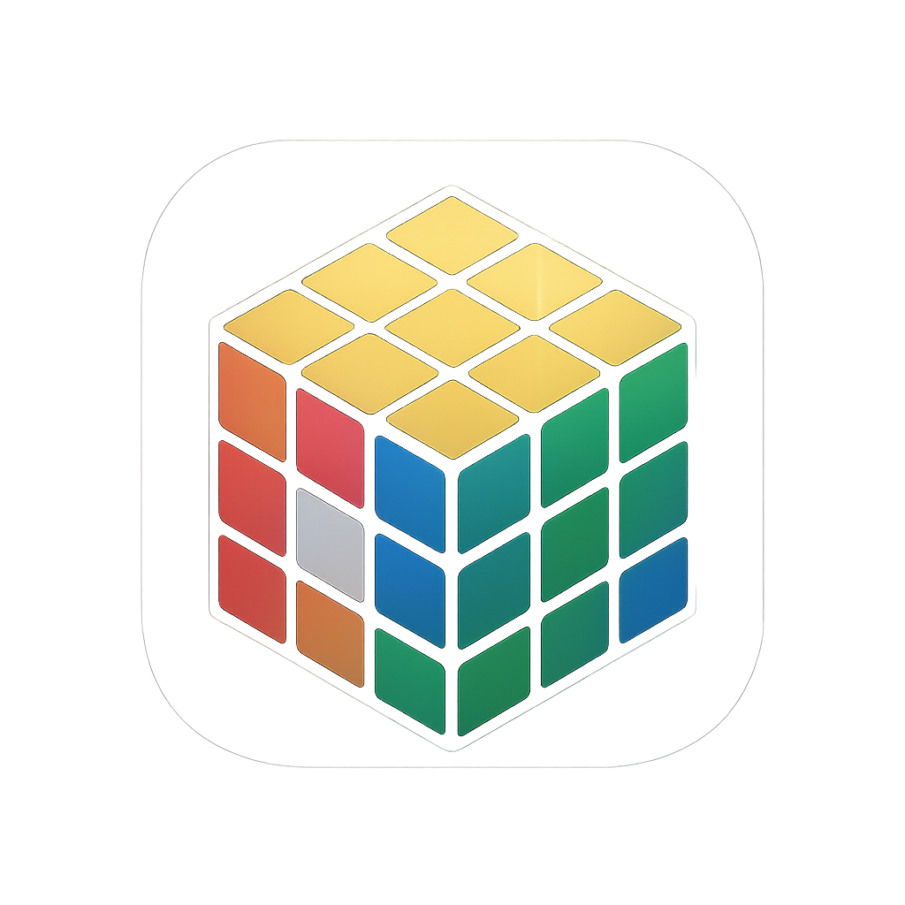

# Rubik Solver

<div align="center">



**Solve 3x3 Rubik's cubes with step-by-step solutions**

[](https://apps.apple.com)
[](https://play.google.com)

</div>

## 📱 About

Rubik Solver is a mobile application that helps you solve 3x3 Rubik's cubes with detailed step-by-step instructions. Perfect for beginners learning to solve the cube and experts looking for efficient solutions.

### Key Features

- 🎯 **Step-by-Step Solutions**: Get detailed instructions to solve any 3x3 Rubik's cube
- 🎨 **2D & 3D Visualization**: View your cube in both 2D and 3D formats
- ✋ **Manual Cube Input**: Input your real-life cube configuration and get a solution
- 🔄 **Automatic Solving**: Advanced algorithms find optimal solutions
- 🌍 **Multi-language Support**: Available in 9+ languages including English, Chinese, Japanese, Korean, Spanish, French, German, and Portuguese
- 🎮 **Interactive Controls**: Manual face rotations and step-by-step solution application

## 🚀 Download

- **iOS**: Coming soon on the App Store
- **Android**: Coming soon on Google Play

## 📖 How to Use

1. **Scramble**: Tap "Scramble" to randomly mix the cube
2. **Solve**: Tap "Solve" to find the solution steps
3. **Apply Solution**: Use "Auto" to automatically apply moves, or step through manually
4. **Manual Input**: Use the edit button to input your real cube configuration
5. **Visualize**: Switch between 2D and 3D views to better understand the cube state

## 🛠️ Technical Details

- **Framework**: Flutter
- **Platforms**: iOS, Android
- **Language**: Dart
- **Cube Library**: [cuber](https://pub.dev/packages/cuber)
- **3D Rendering**: [flutter_scene](https://pub.dev/packages/flutter_scene)

## 📋 Requirements

- iOS 13.0 or later
- Android 5.0 (API 21) or later

## 🔒 Privacy

This app does not collect, store, or transmit any personal data. All cube solving is performed locally on your device.

For more details, see our [Privacy Policy](PRIVACY.md).

## 📄 License

This project is licensed under the MIT License - see the [LICENSE](LICENSE) file for details.

## 🤝 Contributing

Contributions, issues, and feature requests are welcome! Feel free to check the [issues page](https://github.com/lemontree-tech/rubiks_cude_solver/issues).

## 👨‍💻 Development

### Prerequisites

- Flutter SDK (>=3.0.0)
- Dart SDK

### Installation

```bash
# Clone the repository
git clone https://github.com/lemontree-tech/rubiks_cude_solver.git
cd rubiks_cude_solver

# Install dependencies
flutter pub get

# Run the app
flutter run
```

## 📞 Contact

- **GitHub**: [lemontree-tech/rubiks_cude_solver](https://github.com/lemontree-tech/rubiks_cude_solver)
- **Issues**: [Report an issue](https://github.com/lemontree-tech/rubiks_cude_solver/issues)

## 🙏 Acknowledgments

- Built with [Flutter](https://flutter.dev)
- Cube solving algorithms powered by [cuber](https://pub.dev/packages/cuber)
- 3D rendering with [flutter_scene](https://pub.dev/packages/flutter_scene)

---

<div align="center">

Made with ❤️ by [LemonTree Tech](https://github.com/lemontree-tech)

</div>
